# OpsKeeper Architecture (Pi Agent Fleet · okp Phase 1)

**Status**: in progress · **Version**: 1.13 · **Last updated**: 2026-09-12
**Plan reference**: [`plan1.0.md`](./plans/plan1.0.md) §5.5 + 附录 D；[`plan1.1.md`](./plans/plan1.1.md) §5.1 F-1 / F-2
**Branch**: `docs/plan1.0-pi-agent-fleet` · **This revision**: replaces the
`pi --mode http` assumption with the real `pi --mode rpc` protocol
(`internal/edgeagent/pirpc`), wires it into `cmd/opskeeper-edge`, and records
the E2E result against the published `@earendil-works/pi-coding-agent@0.85.1`.

This document is the durable architecture reference for the Pi agent fleet
work (okp Phase 1). It complements `plan1.0.md` — the plan tracks
**what** and **why**; this doc tracks **how** the implemented pieces fit
together.

Diagrams use [mermaid](https://mermaid.js.org/) (GitHub-native). Every
diagram has been hand-validated against the implemented paths in
`internal/edgeagent/` and the F-1 fleet read model at the revision listed above.

---

## 1 · One-paragraph summary

opskeeper-edge (Go 1.25) on a target host supervises a Pi-coding-agent
sidecar (TypeScript, `@earendil-works/pi-coding-agent@0.85.1`) started as
`pi --mode rpc` and driven over its stdin/stdout — Pi opens no socket, so
that channel is not reachable off-host at all. Edge probes it with a real
`get_state` round-trip and restarts a child that stops answering.
Pi calls opskeeper-edge's HTTP tool layer (`127.0.0.1:9101`,
`enforceLoopback`) for host actions. Each tool call passes through
`cmdpolicy.Sandbox` (read-only by default; write paths require an
`X-Opskeeper-Pi-Approval-Token` whose lifetime is governed by
`cmdpolicy.ApprovalCache`) and is appended to `audit.Chain` (HMAC-SHA256,
append-only, local-only today; tunnel uplink in P-5). Edge runs in its
own process group so Pi + skill subprocesses die together when the
supervisor's `Stop` fires.

---

## 2 · Component map

| Layer | Package / Path | Role | Tests |
|---|---|---|---|
| Sidecar | `vendor/pi/` (submodule, `v0.85.1`) | Pi-coding-agent runtime | pin check |
| Process lifecycle | `internal/edgeagent/pisupervisor/` | spawn / health / backoff / crash-loop / Stop | 18 |
| HTTP tool API | `internal/edgeagent/server/` | `127.0.0.1:9101` + `enforceLoopback` | 25 |
| Shell policy | `internal/edgeagent/cmdpolicy/` | `DefaultPiCapable()` + `ApprovalCache` | 13+ |
| Audit | `internal/edgeagent/audit/` | HMAC chain + Verify | 16 |
| Real tools | `internal/edgeagent/host_files/` | `find_large_files` / `du_summary` / `stat_file` | 12+ |
| Real tools | `internal/edgeagent/restart_service/` | systemctl allow-list (Mocked=true today) | – |
| Pi prompt | `pi-skills/*/SKILL.md` + `AGENTS.md` | system prompt / skills | YAML ✓ |
| Hooks | `dist/hooks/hooks.yaml` | pi-yaml-hooks deny-list | yamllint ✓ |
| Upgrade | `scripts/sync-pi.sh` + `.github/workflows/sync-pi.yml` | `git pull --rebase` + verify | shellcheck ✓ |

---

## 3 · Topology — cloud ↔ edge ↔ Pi

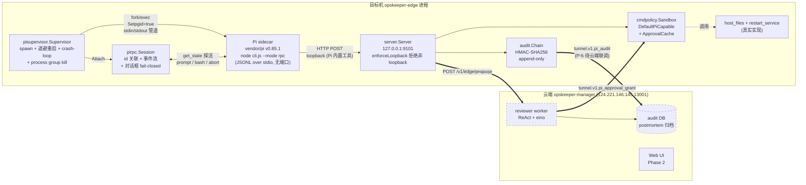

**Trust boundary**: two directions, not one.

- **edge → Pi** 走 stdio。Pi 以 `--mode rpc` 启动，不监听任何端口，因此这条通道
  在物理上不可能被 off-host 访问 —— 比原方案的「HTTP 只绑 loopback」更强。
- **Pi → edge** 仍走 loopback HTTP（`enforceLoopback` 拒绝非 loopback）。Pi 内置
  工具通过它调用 opskeeper 自有能力。

Operators needing remote access must front edge with SSH/Unix-socket — never
relax the loopback check.

---

## 4 · Pi RPC 通道（真实协议，替代原 HTTP 假设）

原 plan1.0 §P-2/§P-3 假设 Pi 可以当 HTTP sidecar 监督（`pi --mode http` +
`GET /health`）。**这两样都不存在**：对已发布产物
`@earendil-works/pi-coding-agent@0.85.1` 实测 `pi --help` 得到

```text
--mode <mode>   Output mode: text (default), json, or rpc
```

唯一的无头双向通道是 `--mode rpc`：子进程 stdin/stdout 上的换行分隔 JSON。
`internal/edgeagent/pirpc` 实现这个协议，`pisupervisor.RPCAttach` 把它接到
supervisor 的探活回路上。

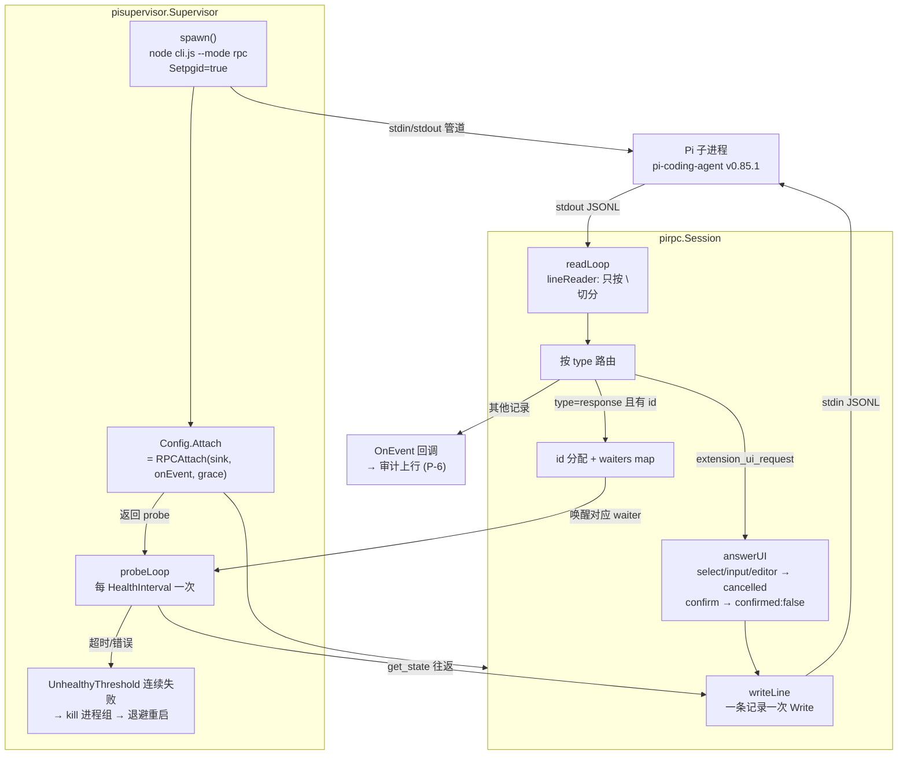

**探活为什么用 `get_state` 而不是 PID**：进程活着不代表 Pi 还在读 stdin、
还能解析 JSONL、还能回话。`attach_test.go` 里有一个刻意「活着但不回话」的
假 Pi —— PID 检查会判它健康，RPC 探活判它不健康并触发重启。

---

## 5 · Pi RPC 帧协议不变量（每条都有测试）

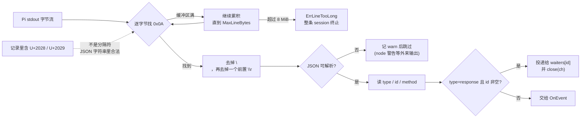

四条不变量与它们的驱动来源：

| 不变量 | 为什么 | 测试 |
|---|---|---|
| 只按 `\n` 切分，U+2028/U+2029 不算换行 | Pi 的 `docs/rpc.md` 明确点名 Node `readline` 不合规；这两个字符在 JSON 字符串里合法 | `TestReadLineSplitsOnLFOnly` |
| 单条记录上限 8 MiB，不是 64 KiB | 未加固主机上 `get_commands` 响应实测超过 64 KiB，小上限是正确性 bug | `TestReadLineHandlesRecordsLargerThanBufio` / `TestLargeResponseRoundTrips` |
| 按 `id` 关联，不按到达顺序 | 响应与事件交错，响应之间也可乱序 | `TestDoCorrelatesByIDNotArrivalOrder` |
| 对话框 fail-closed | dialog 类请求会**阻塞 Pi** 直到客户端回话；插件问「允许这条危险命令吗」时自动放行等于绕过云端 reviewer 双签 | `TestDialogsAreAnsweredFailClosed` |

---

## 6 · Fleet F-1 — host read-model architecture

F-1 adds a cloud-side, read-only fleet view without introducing a new fleet table. The use case joins existing `devices`, `edges`, and `edge_devices` records, while the HTTP layer maps the result into a deliberately narrow response DTO.

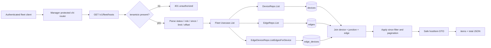

The fleet endpoint is intentionally read-only: no route in this slice mutates a device, edge, or junction. `access_key_id` and `secret_key_hash` remain internal model fields and are never copied into `hostDevice` or `hostEdge`.

## 7 · Fleet F-1 — request and join flow

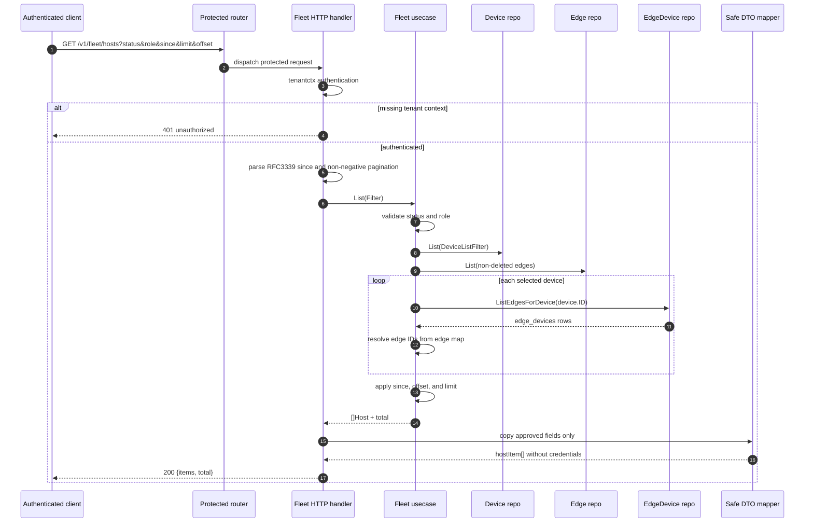

## 8 · Fleet F-1 — filter, pagination, and trust boundary

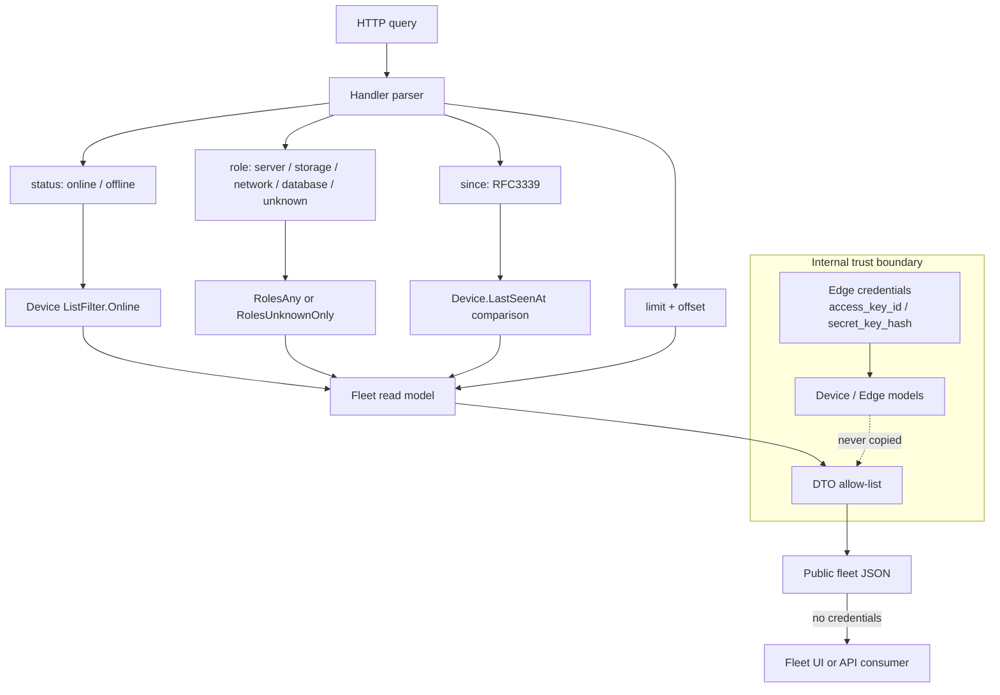

Security invariants for this slice:

- the protected router and `tenantctx` check run before the service call;
- status and role are validated by the use case rather than treated as free-form SQL fragments;
- pagination is applied after the read-model join, and `total` describes the filtered pre-page set;
- the public DTO is an allow-list, so adding a sensitive field to the internal `Edge` model does not expose it accidentally;
- F-1 performs no writes and does not alter the existing edge trust boundary.

---

## 9 · Fleet F-2 — cluster-wide incident aggregation architecture

The alert pipeline already deduplicates **per host**: one
`(scope, device, rule)` triple maps to exactly one `alert_incidents` row
keyed by `dedupe_key`. That keeps a single host's flap from spamming the
board, but it also means a fault that hits N hosts — a bad deploy, a
shared storage backend, a network partition — surfaces as N unrelated
incidents, each with its own RCA. F-2 adds the missing layer: a
deterministic, LLM-free read model that folds per-host incidents into one
cluster-wide incident ("wave").

```mermaid
flowchart LR
    Client[Authenticated fleet client] --> Protected[Manager protected chi router]
    Protected --> HTTP[GET /v1/fleet/cluster-incidents]
    HTTP --> Auth{tenantctx present?}
    Auth -- no --> Unauthorized[401 unauthorized]
    Auth -- yes --> Wired{ClusterService wired?}
    Wired -- no --> NotWired[501 not-wired-yet]
    Wired -- yes --> Parse[Parse status / severity / since / window / min_hosts / limit / offset]
    Parse --> Validate[Validate status / severity / window / min_hosts]
    Validate -- invalid --> Bad[400 invalid]
    Validate -- ok --> UC[ClusterUsecase.List]

    UC --> IncRepo[IncidentRepo.ListIncidents<br/>newest-first, capped at 2000 rows]
    UC --> DevRepo[DeviceRepo.List<br/>best-effort host facts]
    IncRepo --> Incidents[(alert_incidents)]
    DevRepo --> Devices[(devices)]

    Incidents --> Classify[classifyAnomaly<br/>rule key to root-cause class]
    Incidents --> Dimension[signalDimension<br/>host-identity labels stripped]
    Classify --> Bucket[Bucket by class + dimension]
    Dimension --> Bucket
    Bucket --> Wave[Split each bucket into waves<br/>by sliding first-firing window]
    Wave --> Rollup[Per-host rollup<br/>join device facts, worst severity/status wins]
    Devices --> Rollup
    Rollup --> Floor[Drop waves below MinHosts]
    Floor --> Sort[Sort most-severe-first]
    Sort --> Page[Paginate AFTER grouping]
    Page --> DTO[clusterIncidentItem DTO]
    DTO --> Response[items + pre-pagination total]
```

F-2 is read-only: it consumes `alert_incidents` + `devices` and writes
nothing. The grouping decision is deterministic — the same incident rows
always produce the same groups in the same order — so the API is safe to
cache and the tests assert exact output. Semantic "same root cause"
ranking beyond this stays with the existing LLM semantic-dedup layer in
`internal/manager/biz/alert`, which this read model consumes rather than
duplicates.

## 10 · Fleet F-2 — grouping rule, ranking, and trust boundary

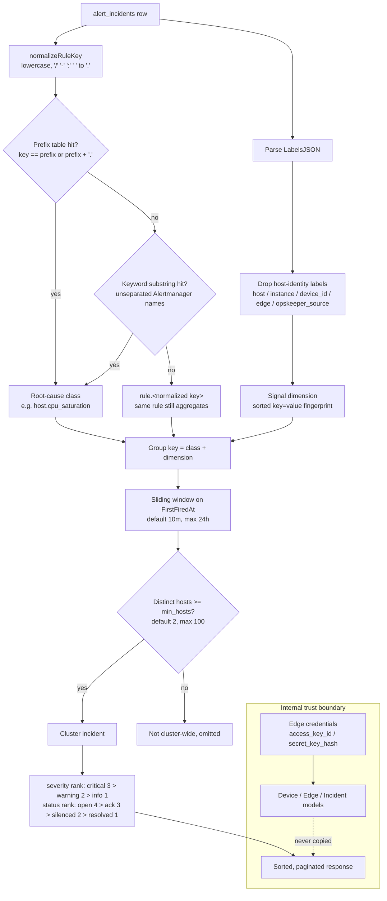

**Grouping rule.** Two incidents join the same wave when they share
(1) the same anomaly class derived from the rule key, (2) the same signal
dimension with host-identity labels stripped, and (3) a bounded
first-firing window (sliding, default 10 minutes). A recurrence outside
the window becomes a separate wave, so the view never merges an unrelated
recurrence into a stale group. A group needs at least `min_hosts`
(default 2) distinct hosts to be considered cluster-wide; an incident
with no `device_id` still counts as a member but never as a host.

**Two rule-key families reach `alert_incidents`**, and the classifier
covers both:

| Family | Example key | How it matches |
|---|---|---|
| Built-in seed rules (`seed_rules.go`) | `cpu_high`, `disk_full_warning`, `scrape_down` | exact prefix-table entry |
| Harness / custom `<domain>/<case>` keys | `host/cpu-spike`, `k8s/pod-oom` | prefix table after separator normalization |
| Alertmanager alert names forwarded by webhook | `HostHighCpuLoad`, `KubePodOOMKilled` | substring keyword stage (no separator exists to match a prefix) |

A key that matches nothing keeps its own class (`rule.<normalized>`), so
"same rule" still aggregates across hosts even when the rule is unknown.

**Security invariants for this slice** mirror F-1: the protected router
and `tenantctx` check run before the service call; an unwired
`ClusterService` answers `501`, not `500`; filter values are validated by
the use case rather than passed through; pagination applies after
grouping and `total` describes the pre-page grouped set; and the public
DTO is an allow-list, so the response carries incident ids, titles,
severities and timestamps — never credentials.

---

## 11 · Sequence — single tool call (read path)

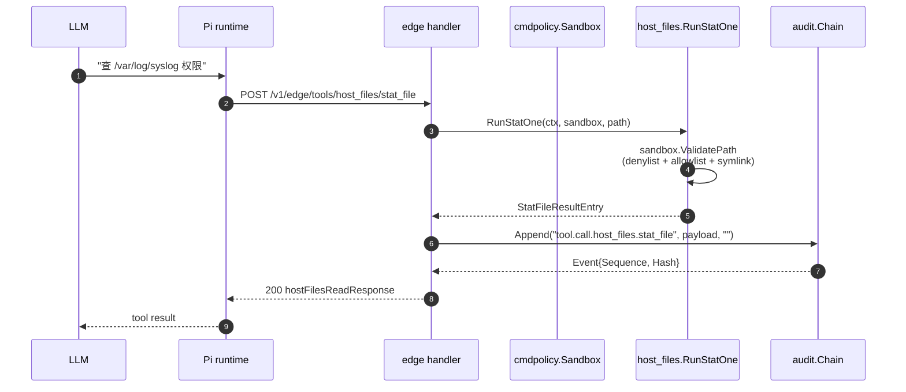

---

## 12 · Sequence — write path (approval gate)

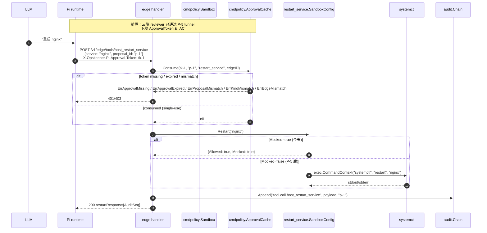

---

## 13 · State machine — pisupervisor.Supervisor

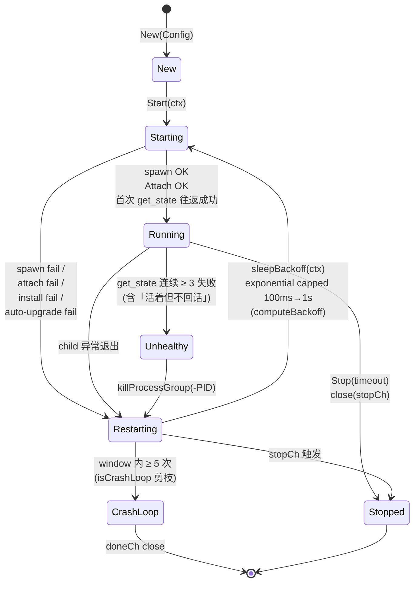

**Key invariants**

- `runLoop` puts `child.Wait()` in a side goroutine so `stopCh` /
  `ctx.Done()` can interrupt a stuck child. Stop's deadline timer falls
  back to `killProcessGroup(-PID, SIGKILL)` if the child hasn't drained.
- `Setpgid` on spawn ensures `kill -PID` takes down Pi's entire
  subprocess tree (LLM stream, skill subprocesses).
- `Upgrade()` refuses without `TagLock` — defense against upstream
  tag-flipping.
- `installExtraPackages` is pre-flight; failure flips state to
  `CrashLoop` (fail-closed).
- 探活是 `Config.Attach` 返回的 `get_state` 往返，不是 HTTP。每次重启产生一个
  **新的** `pirpc.Session`；旧 session 在 teardown 里 close，`SessionSink`
  被 clear，任何持有旧引用的调用方会拿到 `ErrSessionClosed` 而不是静默挂住。

---

## 14 · Module dependency graph

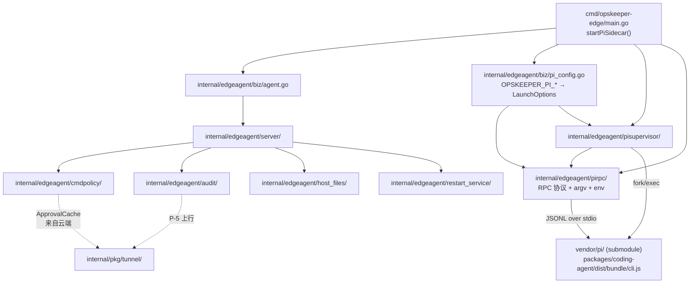

Solid arrows = implemented dependencies. Dashed arrows = planned (P-5
tunnel RPC: approval grant downlink + audit uplink). `startPiSidecar`
in `cmd/opskeeper-edge/main.go` is the wiring that landed this round —
it reads `OPSKEEPER_PI_*`, builds the `--mode rpc` argv, injects the
provider credential through the child's env, and starts the supervisor
with `RPCAttach`. It is a no-op unless `OPSKEEPER_PI_ENABLED=true`, and
any failure in it leaves the rest of the edge running.

---

## 15 · Audit chain data model

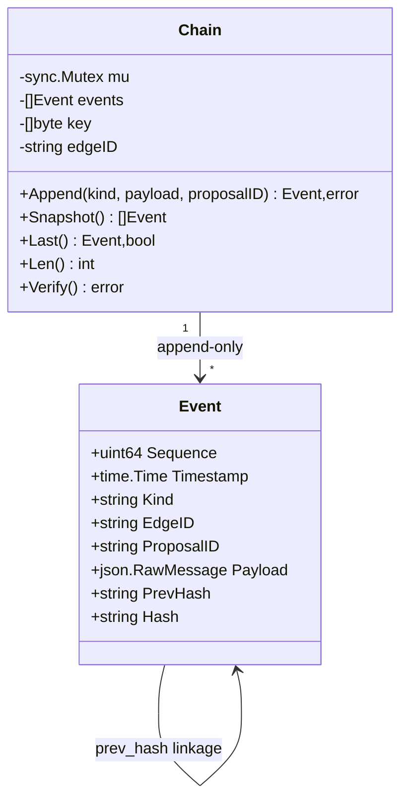

**Triple verification** (per `audit.Chain.Verify`):

1. Dense sequence — `Sequence[i] == i+1`
2. `PrevHash[i] == Hash[i-1]`
3. Recompute digest under key; compare to `Hash[i]`

Genesis prev_hash = 32 zero bytes. `MinKeyBytes=32` enforced.

---

## 16 · cmdpolicy class taxonomy

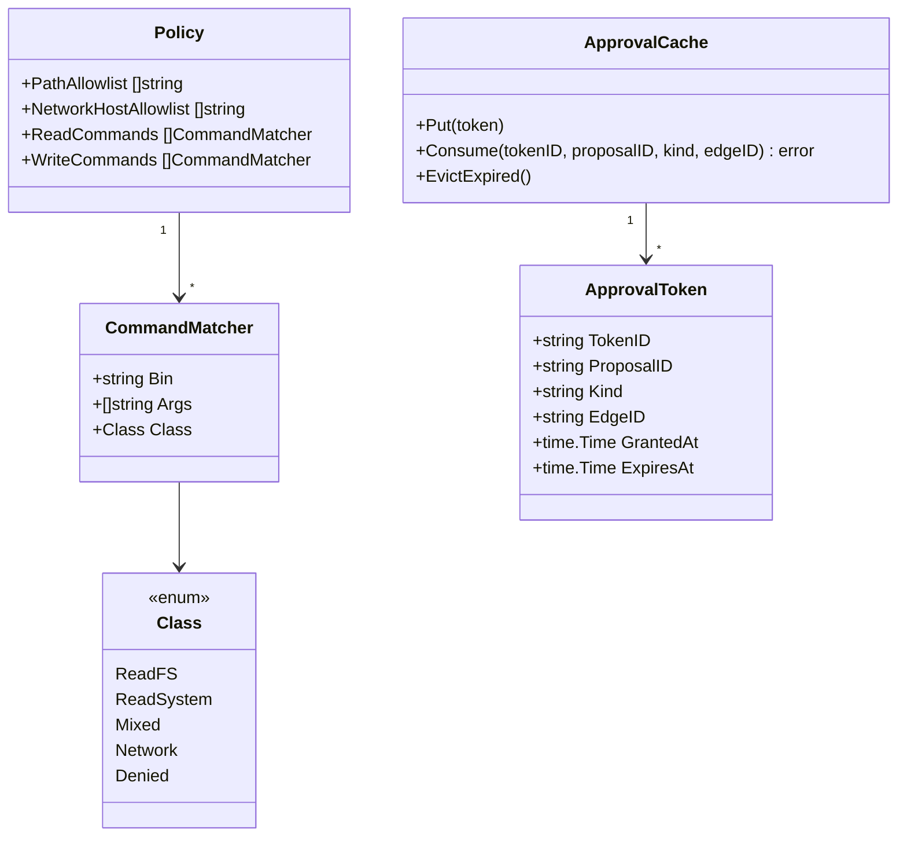

**DefaultPiCapable** (`internal/edgeagent/cmdpolicy/policy_pi.go`):
`DefaultReadOnly ∪ {kill -l, pgrep, pidof, pkill --list}`, with
`PathAllowlist` widened for systemd/journal/os-release and
`NetworkHostAllowlist` restricted to `127.0.0.0/8 + ::1/128`.

---

## 17 · Deployment view (target host)

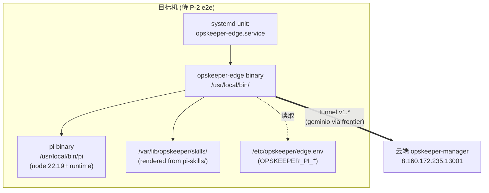

**State of the world today**: code is committed; the systemd unit, edge
binary installation, and `edge.env` are P-2 e2e work that requires a
target host (currently a documented blocker).

---

## 18 · Status matrix (plan §5.5 + plan1.1 F-1 / F-2)

| State | Count | Items |
|---|---:|---|
| ✅ verified | 11 | P-1, P-7, P-8, P-11, P-12, G-2 (partial), G-5, plan1.1 F-1, plan1.1 F-2, **P-2R Pi RPC 通道**, **P-13 edge 启动接线** |
| 🟡 partial | 5 | P-3, P-4, P-6, G-3, plus the remaining partial baseline items |
| ⛔ blocked | 32 | plan1.0 unfinished items plus F-3/A-1/A-2/A-3/S-1/S-2/S-3 |

Across plan1.0 and plan1.1 this is **22.9% verified, 10.4% partial, and 66.7% blocked** (11/48, 5/48, 32/48). These are work-item states, not production-readiness or code-coverage percentages. P-2 moved from 🟡 to ✅ because its transport is now the real protocol and is verified against the published Pi artefact, not a hypothetical HTTP endpoint.

The blocked work is primarily constrained by:

1. **Target host** for real edge deployment + systemd unit
2. **LLM API key** to feed Pi (`OPSKEEPER_PI_LLM_*`) — needed for a
   prompt-driven RCA; the transport itself is verified without one
3. **Cloud admin credentials** for reviewer worker + audit DB

---

## 19 · What's verified end-to-end today

| Path | Verified by | Status |
|---|---|---|
| `vendor/pi` pinned to `v0.85.1` | `git describe` | ✅ |
| 4 SKILL.md frontmatter | YAML parse | ✅ |
| `scripts/render-pi-system-md.py` idempotency | render→check→drift detect | ✅ |
| `dist/hooks/hooks.yaml` syntax | yamllint | ✅ |
| `scripts/sync-pi.sh` shellcheck | shellcheck 0 errors | ✅ |
| `.github/workflows/sync-pi.yml` syntax | yamllint 0 errors | ✅ |
| `internal/edgeagent/cmdpolicy` tests | `go test` 13+ cases | ✅ |
| `internal/edgeagent/audit` tests | `go test` 16 cases | ✅ |
| `internal/edgeagent/pisupervisor` tests | `go test` 18 cases | ✅ |
| `internal/edgeagent/server` tests | `go test` 25 cases | ✅ |
| `internal/edgeagent/host_files` tests | `go test` 12 cases | ✅ |
| `GET /v1/fleet/hosts` read model and handler | targeted `go test -mod=mod` + `go vet -mod=mod` | ✅ |
| `GET /v1/fleet/cluster-incidents` grouping usecase | targeted `go test -mod=mod` 13 cases + `go vet -mod=mod` | ✅ |
| `GET /v1/fleet/cluster-incidents` HTTP contract | targeted `go test -mod=mod` 6 cases (auth 401 / unwired 501 / filter parse / 400 / error map / empty array) | ✅ |
| Pi's actual CLI surface (`--mode text/json/rpc`, no HTTP mode) | `pi --help` on the installed `@earendil-works/pi-coding-agent@0.85.1` | ✅ |
| `internal/edgeagent/pirpc` protocol client | `go test` 36 cases, `-race` clean, on Windows and Linux | ✅ |
| **Real Pi RPC round-trip** (`get_state` / `get_commands` / direct `bash` / `abort`) | `TestE2EAgainstRealPi` against the real published binary — no LLM key needed, no tokens spent | ✅ |
| `get_state` liveness probe rejects a live-but-mute child | `TestRPCAttachRestartsChildThatStopsAnswering` (fake Pi that reads stdin and never answers) | ✅ |
| Provider credential goes to env, never argv | `TestBuildEnv*` + `TestBuildSupervisorConfig_UsesNodeAndScriptWhenBinUnset` | ✅ |
| `startPiSidecar` compiles into the Linux edge binary | `GOOS=linux go build ./cmd/opskeeper-edge` | ✅ |

---

## 20 · What's NOT verified (and what blocks it)

| Path | Blocker |
|---|---|
| Pi running under systemd on a real target host | Target host |
| A full prompt-driven RCA turn (`prompt` → tool calls → `agent_settled`) | LLM provider key. The transport carrying it is verified; the reasoning loop is not. |
| Edge HTTP listening on `127.0.0.1:9101` | Target host (test-only via httptest) |
| Real `systemctl restart nginx` shell-out | Target host |
| `piSessions` consumed by an RCA driver | The holder and its lifecycle are wired and tested; no caller reads it yet (that is F-3 / G-3) |
| `tunnel.v1.pi_audit` / `pi_approval_grant` uplink | Cloud admin credentials |
| Web UI Pi tab | Cloud admin + frontend env |
| Harness cases `internal/harness/cases/pi/*` | devbox-internal but deferred to P-10 |
| Full `cmd/opskeeper` binary build | devbox has `CGO_ENABLED=0` and no `gcc`. `internal/pkg/embedding` imports `github.com/anush008/fastembed-go`, which imports `github.com/yalue/onnxruntime_go` — a cgo-only package with no files under that constraint, so anything linking the embedding chain (including `data/alert/store` and therefore `cmd/opskeeper`) fails to link. Both fleet packages build, vet and test clean with `-mod=mod`. |
| F-2 grouping against a live `alert_incidents` table | Needs cloud admin credentials + a populated incident history |

---

## 21 · Open questions for the operator

1. Which host should we deploy edge to first? (Need SSH + systemd +
   network reachability to `8.160.172.235:13001`.)
2. LLM provider + API key? (Plan §6.4 expects `OPSKEEPER_PI_LLM_*`.)
3. GitHub push: PAT / SSH key / gitcode mirror?
4. Cloud admin user for the reviewer worker (NOT the `Lumosai2026` —
   that password was rotated already).

---

## Appendix · Repo layout

```
opskeeper/
├── cmd/opskeeper-edge/main.go         (TODO — wired in v1.11)
├── docs/
│   ├── architecture.md                ← this file
│   └── plans/plan1.0.md               ← master plan
├── dist/hooks/hooks.yaml              (P-12 pi-yaml-hooks)
├── pi-skills/                         (P-7 + P-8)
│   ├── opskeeper-restart-service/SKILL.md
│   ├── opskeeper-host-files/SKILL.md
│   ├── opskeeper-diagnostics/SKILL.md
│   ├── opskeeper-incident-report/SKILL.md
│   └── opskeeper-monitor/AGENTS.md
├── scripts/
│   ├── sync-pi.sh                     (G-5 upgrade)
│   └── render-pi-system-md.py         (P-8)
└── internal/
    ├── edgeagent/
    │   ├── audit/         chain.go        (P-6)
    │   ├── biz/           agent.go        (TODO)
    │   ├── cmdpolicy/     policy_pi.go    (P-4)
    │   │                  approval.go
    │   ├── host_files/    handlers.go     (P-3 helpers)
    │   ├── pisupervisor/  supervisor.go   (P-2)
    │   │                  health.go
    │   └── server/        server.go + 6   (P-3)
    │                      handler files
    └── manager/
        ├── biz/fleet/     usecase.go      (F-1 read model)
        │                  repo.go
        │                  cluster.go      (F-2 cluster aggregation)
        ├── server/fleet/  http.go         (/v1/fleet/hosts + cluster-incidents)
        └── data/alert/store/              (F-2 source: alert_incidents)
```
